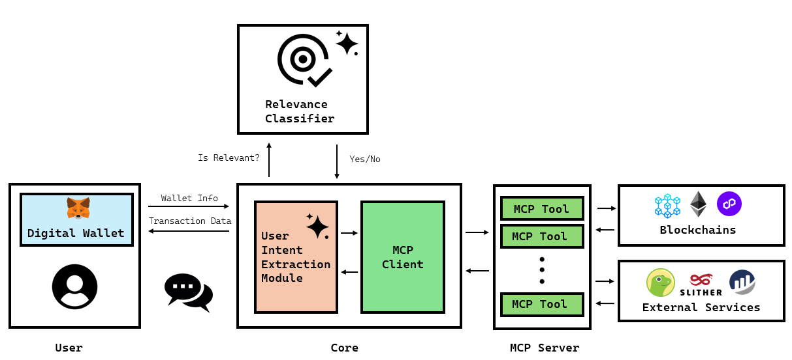

# Blockchain Agent with MCP

##  Abstract

The evolution of the Internet from centralized service providers to decentralized architectures marks a pivotal shift toward digital autonomy and transparency. Blockchain technologies have driven this transformation by enabling trustless, peer-to-peer interactions and fueling the emergence of Web3 services. However, the inherent complexity of blockchain systems still poses a significant barrier for non-technical users. To address this challenge, we present a modular architecture that seamlessly integrates Artificial Intelligence (AI) agents with blockchain environments to democratize access and simplify user interactions. Our system utilizes large language models (LLMs) to interpret user intent, filters out irrelevant or unsafe inputs using a lightweight relevance classifier, and executes validated actions via the Model Context Protocol (MCP). By abstracting technical complexities and incorporating human- in-the-loop safeguards, our approach promotes a more accessible, secure, and user-centric decentralized ecosystem.

---

## Overview
A lightweight web app + Node server that lets you interact with EVM-compatible blockchains through a conversational agent backed by MCP tools.
- Purpose: Provide a simple, guided UX to perform common blockchain actions via an AI assistant and a set of MCP tools.
- Tech: Front-end (HTML/CSS/JS + MetaMask), back-end Node.js (Express, Ethers v5, MCP SDK), optional external APIs.
- Scope: Read account data, prepare/send transactions with MetaMask, deploy and interact with contracts, get crypto prices, review recent tx history, and audit contracts.

---

## Architecture

Components:
- End User: An individual who queries the blockchain or initiates transactions using a digital wallet.
- Digital Wallets: Applications that manage cryptocurrencies, tokens, and NFTs. They securely store cryptographic keys, handle user authentication, and implement Human-in-the-Loop (HIL) mechanisms for transaction confirmation.
- User Intent Extraction Module (UIEM): Captures and interprets user intent using an underlying LLM. It extracts relevant parameters, selects the appropriate tool, provides textual feedback, and maintains context across interactions.
- Relevance Classifier: Evaluates user input for relevance to the agent’s scope. Relevant requests are forwarded to the UIEM; irrelevant ones trigger an error message.
- MCP Client: Receives tool execution instructions from the UIEM, communicates with the MCP Server, invokes the tool, and retrieves the response.
- MCP Server: Hosts and executes tools exposed via MCP. Upon invocation, it runs the requested tool and returns the result as a JSON message.
- Blockchains: Decentralized networks that support user interactions and transactions via APIs accessible through digital wallets.
- External Services: Blockchain-related services accessible via APIs, providing network state information or higher-level functionalities.

<p align="center">
 <table class="tg">
  <tr>
    <td class="tg-c3ow"></td>
  </tr>
</table>
</p>

Workflow:
- User Authentication: the user authenticates via their digital wallet, which serves as a unique identity within the blockchain ecosystem. Authentication responsibilities are fully delegated to the wallet, ensuring the agent never directly accesses sensitive personal data. All blockchain interactions initiated by the user are exclusively routed through the wallet, which retains sole authority to sign transactions. Furthermore, contemporary digital wallets implement a human-in-the-loop mechanism for transaction approval. Before executing irreversible actions, such as token transfers, cryptocurrency swaps, or smart contract deployments, the system prompts the user for explicit confirmation.

- Relevance Filtering: when a user submits a command via the chatbot interface, the message is first evaluated by a Relevance Classifier before reaching the core AI agent. This classifier, powered by a lightweight LLM, performs semantic analysis to assess whether the input aligns with the agent’s functional scope. This filtering step reduces off-topic interactions and enhances overall user experience by ensuring only pertinent inputs reach the core system.

- Extracting User Intent and Parameters: after the relevance validation, user's message is  forwarded to the main model for deeper analysis. The primary function of UIEM is to interpret natural language input, identify the user's intent, and map it to one of the agent’s predefined actions. It also extracts and validates associated parameters to ensure they meet the required format, completeness, and clarity for reliable execution. If the request can be resolved internally, the model generates a JSON-formatted response for the user interface. For blockchain-related tasks or external service calls, it acts as a coordinator—mapping intent to the appropriate MCP tool, assembling required parameters, and verifying their integrity. When parameters are missing or unclear, the UIEM initiates a clarification loop, prompting the user for additional input. This ensures that operations proceed only when fully defined and authorized, minimizing errors and unintended actions.
Once all information is validated, the module invokes the selected MCP tool via the MCP Client to execute the requested operation.

- Command Execution: upon receiving a request from the MCP Client, the MCP Server executes the designated tool using the provided parameters. The tool performs a secondary validation to ensure semantic correctness and logical coherence. Once validated, the tool proceeds to execute the requested operation, which may involve interacting with external APIs, blockchain nodes, or other services. Outputs are formatted for readability to facilitate user interpretation. Final submission of transactions is delegated to the user's wallet, ensuring HIL confirmation as a safeguard against unauthorized execution.

---

## Repository Structure
- `ai_agent.html`: Main UI page for the agent.
- `server.js`: Express server, MCP client bootstrap, static hosting, and API proxies.
- `package.json`: Node project metadata and dependencies.
- `supportedChains.js`: Chain registry (IDs, symbols, RPC URLs via Infura where applicable).
 - `datasets/`: Collection of curated query datasets used for evaluation.

Folders
- `css/`: Styles for the UI (`styles.css`).
- `img/`: UI icons and images (MetaMask, etc.).
- `js/`
  - `interact.js`: UI logic, message handling, buttons, and MetaMask-driven flows.
  - `script.js`: Core app logic: MetaMask connection, MCP action execution, Claude proxy calls, pending tx flow.
  - `walletInteraction.js`: Sends native transfers and contract tx via MetaMask; deploys contracts using signer.
  - `chainsClient.js`: Chain name/ID helpers for network mapping.
  - `confirmation.js`: Pending transaction widgets and status updates in the UI.
- `mcp/`
  - `tools.js`: Registers MCP tools (getBalance, getGasPrice, getTransactions, getPrice, prepareTransaction, deploySC, prepareContractInteraction, list/describe contracts, audit via API, writeContract).
  - `contracts.js`: Persists deployed contracts in `.data/contracts.storage.json` and exposes helper queries/resources.
  - `contractInteraction.js`: Prepares read/write calls to deployed contracts; simulates reads and estimates gas.
  - `contractWriter.js`: Generates contracts from natural-language prompts.
  - `deployContract.js`: Compiles Solidity, estimates deployment gas/cost; front-end completes with MetaMask.
  - `prepareTransaction.js`: Validates, estimates and returns metadata for native transfers.
  - `transactionHistory.js`: Fetches recent transactions via Etherscan-family API.
  - `priceUtils.js`: Retrieves crypto prices (CoinGecko) and formats output.
  - `scanContractsApi.js`: Audits contracts via ChainGPT API and stores text reports in `.reports/`.
- `datasets/`
  - `EvaluationDataset`: Contains ONLY relevant queries. Goal: evaluate correctness of parameter extraction and validate final tool response.
  - `AblationStudyDataset`: 50% relevant and 50% irrelevant queries. Goal: measure relevance classifier effectiveness and impact on downstream action selection.
- Root-generated folders at runtime
  - `.data/`: Local storage (e.g., `contracts.storage.json`).
  - `.reports/`: Vulnerability scan reports (served at `/reports`).
  - `.generated-contracts/`: Contracts/artifacts saved by tools that generate code.

Relevance Classifiers
- `relevanceClassifier.js`: Uses the local Claude proxy endpoint.
- `relevanceClassifierGemini.js`: Alternative relevance classifier using Gemini API.

---

## Prerequisites
- Node.js 18+ (ESM support, fetch, and modern Express).
- Browser with MetaMask extension installed.
- Optional: Ganache (or another local EVM RPC) for local testing.

---

## Environment Variables
Create a `.env` file in the project root. Only set what you need; keys marked (optional) unlock extra features or reduce rate limits.

Required for most networks
- `INFURA_API_KEY`: Used to build RPC URLs for many supported chains.

LLM and classification
- `CLAUDE_API_KEY`: Required for the built-in relevance and intent analysis proxy (`/api/claude`).
- `GEMINI_API_KEY` (optional): If you switch the relevance classifier to Gemini.

Explorers and auditing
- `ETHERSCAN_API_KEY` (optional): Increases limits and enables richer history on Etherscan-family explorers.
- `CHAINGPT_API_KEY` (optional but recommended for audits): Enables smart-contract vulnerability scanning via ChainGPT.

Example `.env`:
```
INFURA_API_KEY=your_infura_key
CLAUDE_API_KEY=your_claude_key
ETHERSCAN_API_KEY=your_etherscan_key    # optional
CHAINGPT_API_KEY=your_chaingpt_key      # optional
GEMINI_API_KEY=your_gemini_key          # optional
```

---

## Setup & Run Locally
1) Install dependencies
```powershell
npm install
```

2) Create the `.env` file as shown above (at project root).

3) Start the server (serves static files and exposes APIs on port 3000)
```powershell
node server.js
```
- Or via VS Code Tasks: "Start dev server".
- The server serves the project folder statically.

4) Open the UI
- Navigate to `http://localhost:3000/ai_agent.html`.

5) MetaMask network
- For public testnets (e.g., Ethereum Sepolia, Polygon Amoy, Base/Arbitrum/Optimism     Sepolia), ensure MetaMask is on the same network your action targets.
- For local testing with Ganache:
  - Start Ganache on `http://127.0.0.1:7545` (chainId `1337`).
  - Add a Custom Network in MetaMask pointing to that RPC and chain ID.

---

## Using the App
- In the browser UI:
  - Click "Connect Wallet" and approve the connection in MetaMask.
  - Once connected, the input box activates. Ask things like:
    - "Show my balance"
    - "Send 0.01 ETH to 0x..."
    - "What is the gas price?"
    - "What is BTC in USD/EUR?"
    - "Show my last 5 transactions"
    - "List my deployed contracts"
  - For contracts:
    - Use "Deploy Smart Contract" to upload a `.sol` file, optionally set constructor args (JSON array), then deploy with MetaMask.
    - Use "Smart Contract Audit" to upload a `.sol` file and run an API-based audit (requires `CHAINGPT_API_KEY`).
    - To interact with a previously deployed contract, ask the assistant to prepare a function call; you will confirm via MetaMask.

- Transaction flow:
  - The agent prepares all transaction details. You’ll see a confirmation question in chat.
  - Approve in MetaMask when prompted; a sidebar shows pending transactions until mined.

---

## Supported Chains 
- Ethereum (Mainnet, Sepolia)
- Arbitrum (One, Sepolia)
- Base (Mainnet, Sepolia)
- Optimism (Mainnet, Sepolia)
- Polygon (Mainnet, Amoy)
- Avalanche (C-Chain, Fuji)
- BSC (Mainnet, Testnet)
- Ganache

The full mapping and RPC endpoints are defined in `supportedChains.js` (many use Infura URLs built with `INFURA_API_KEY`).

---

## Data & Logs
- Contracts registry: `.data/contracts.storage.json` .
- Audit reports: `.reports/`.
- Generated contracts: `.generated-contracts/`.

---

## Notes & Tips
- Always match your MetaMask network to the action’s network if you want to commit a transaction. If they differ, the app asks you to switch networks in MetaMask and try again.
- Explorer APIs may rate-limit requests; setting `ETHERSCAN_API_KEY` helps.
- Do not hard-code your API keys; save them in environment variables with `.env` file.
